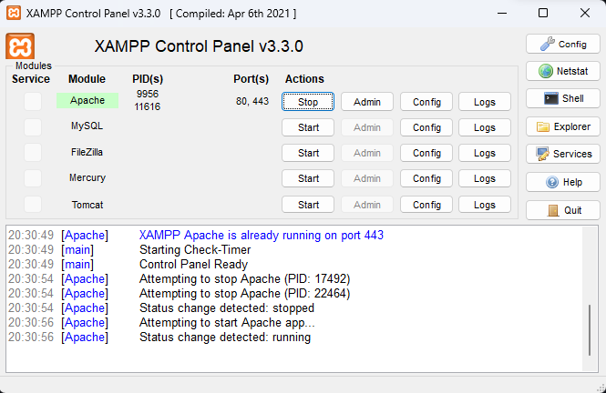
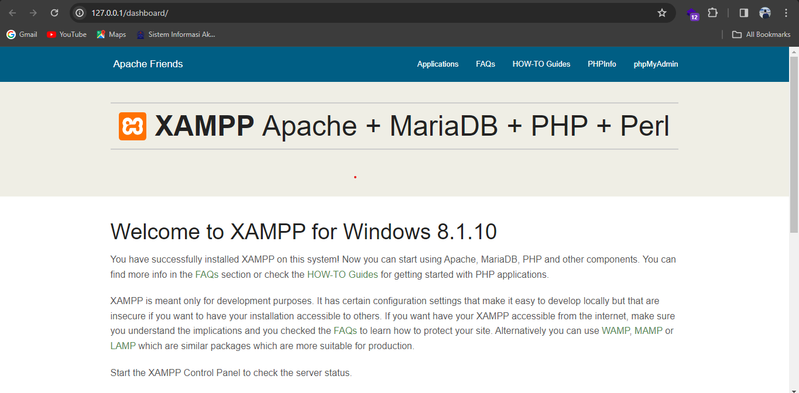
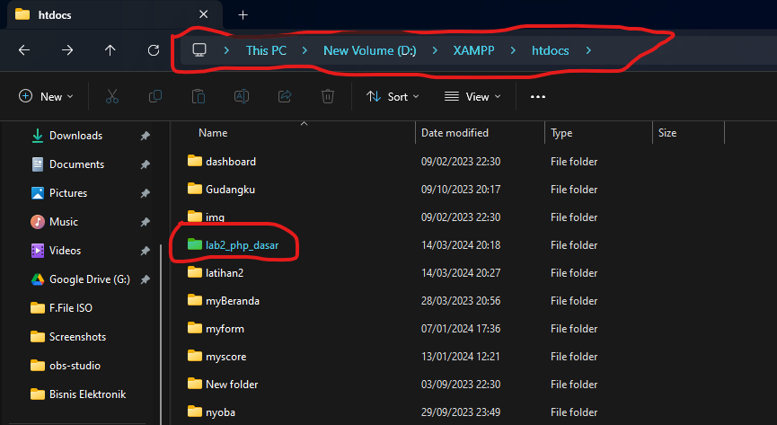
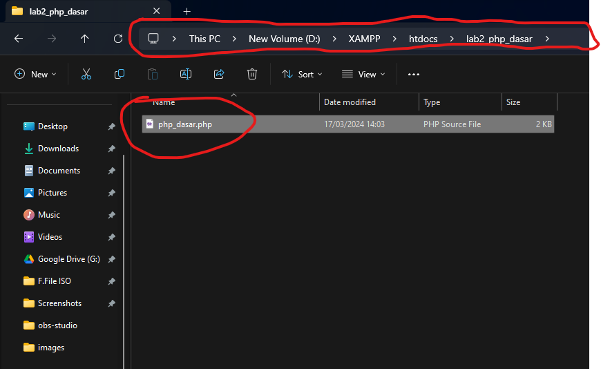
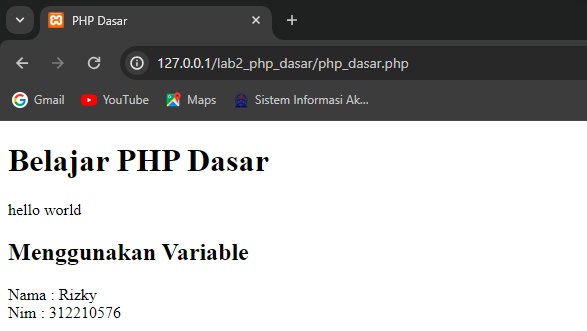
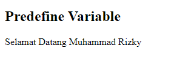
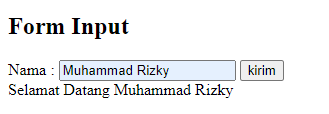

# Tugas Pemrograman Web 2 Pertemuan 3

---

Nama : Muhammad Rizky<br>
NIM : 312210576<br>
Kelas : TI.22.B2<br>
Mapel : Pemrograman Web 2<br>

**Daftar isi**

> - [Latihan Module 1](#latihan-module-1)
> - [Tugas Praktikum](#tugas-praktikum)

# `Pembukaan`

PHP adalah singkatan dari PHP Hypertext Preprocessor dan merupakan bahasa pemrograman yang dirancang khusus untuk pengembangan web. PHP memiliki sifat Server-Side karena dijalankan atau dieksekusi dari sisi server. Ini berarti PHP dijalankan pada komputer server dan bukan pada komputer klien. PHP dijalankan melalui aplikasi web browser seperti halnya HTML. Hampir semua situs besar dan populer dikembangkan menggunakan PHP, seperti WordPress, Joomla, Facebook, Twitter, Wikipedia, dan banyak lagi.

# `Latihan Module 1`

1. **Persiapkan text editor:** Misalnya VSCode.
2. **Buat folder baru:** Buat folder dengan nama `lab2_php_dasar` pada docroot webserver (htdocs).

### Install XAMPP

- Unduh XAMPP dari [situs resminya](https://www.apachefriends.org/download.html) dan pilih versi portable.
- Extract file tersebut dan sesuaikan direktorinya, misalnya `d:\xampp`.

### Konfigurasi Web Server

- **Konfigurasi Apache:** Lokasi file `xampp\apache\conf\httpd.conf`.
- **Konfigurasi PHP:** Lokasi file `xampp\php\php.ini`.
- **Konfigurasi MySQL:** Lokasi file `xampp\mysql\bin\my.ini`.

### Menjalankan Web Server

- Untuk menjalankan web server, gunakan XAMPP Control.



- Uji coba apakah server sudah berjalan dengan baik: [http://127.0.0.1](http://127.0.0.1) atau [http://localhost](http://localhost).



### Memulai PHP

- Buat folder `lab2_php_dasar` pada root directory web server (`d:\xampp\htdocs`).
- Untuk mengakses direktori tersebut, gunakan URL: [http://localhost/lab2_php_dasar/](http://localhost/lab2_php_dasar/).



### PHP Dasar

- Buat file baru dengan nama `php_dasar.php` dalam folder tersebut.
- Tulis kode dasar PHP di dalamnya, seperti contoh yang diberikan dalam modul praktikum.



### Variable PHP

- Mulailah menambahkan variabel pada program PHP untuk menyimpan data.



### Predefined Variable $\_GET

- Gunakan predefined variable `$_GET` untuk mengambil nilai dari URL.



### Membuat Form Input

- Buatlah form input HTML yang memungkinkan pengguna memasukkan data.
- Proses data yang dikirimkan dapat ditangani oleh PHP.



### Operator, Kondisi, dan Perulangan

- Gunakan operator, kondisi (if-elseif-else, switch), dan perulangan (for, while, do-while) untuk mengontrol alur program PHP sesuai kebutuhan.


Dengan mengikuti langkah-langkah di atas, Anda dapat mulai belajar dan mengembangkan aplikasi web menggunakan PHP. Selamat mencoba!

# `Tugas Praktikum`

Buat program sederhana untuk menambahkan data kedalam sebuah list dengan rincian sebagai berikut:

> • Progam meminta memasukkan data sebanyak-banyaknya (gunakan perulangan)<br>
> • Tampilkan pertanyaan untuk menambah data (y/t?), apabila jawaban t (Tidak), maka program akan menampilkan daftar datanya. • Nilai Akhir diambil dari perhitungan 3 komponen nilai (tugas: 30%, uts: 35%, uas: 35%)<br>
> • Buat flowchart dan penjelasan programnya<br>

## `Flowchart`


## `Code`

```python
    # import package tabulate
    from tabulate import tabulate

    # membuat list kosong untuk menampung data
    dataMahasiswa = []
    no = 0

    # melakukan perulangan input sesuai keinginan sampai pertanyaan tambah data dimunculkan kembali
    while(True):
    # membuat variable untuk menampung inputan
        no += 1
        nama = input("Masukan Nama : ")
        nim = input("Masukan NIM : ")
        tugas = float(input("Masukan Nilai Tugas : "))
        uts = float(input("Masukan Nilai UTS : "))
        uas = float(input("Masukan Nilai UAS : "))

    # menjumlahkan nilai dari tugas,uts dan uas
        nilaiAkhir = (tugas * 30 / 100) + (uts * 35 / 100) + (uas * 35 / 100)

    # menambahkan data input ke list dataMahasiswa
        dataMahasiswa.append(
            [no, nama, nim, tugas, uts, uas, nilaiAkhir])

    # input tambah data jika tekan y maka input kembali, selain itu berhenti dan tampilkan data
        tambahData = input("Tambah Data? (y/t) : ")
        if(tambahData == "t"):
            break

    # tampilkan dataMahasiswa menggunakan tabulate package agar tampilan berbentuk table

    print(tabulate(dataMahasiswa, headers=[
        "No", "Nama", "Nim", "Tugas", "UTS", "UAS", "Nilai Akhir"], tablefmt="fancy_grid"))
```

## `Hasil`


### Terimakasih...
